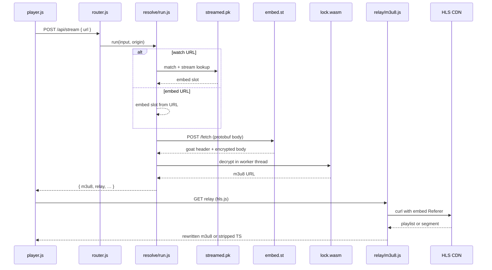

# Streamed.pk HLS Stream Resolver

Local server that turns a [streamed.pk](https://streamed.pk) or [embed.st](https://embed.st) stream URL into a playable HLS playlist. It replays the embed.st client handshake in Node, decrypts the upstream M3U8 with `lock.wasm`, and relays HLS when the CDN rejects bare requests.

Requires Node.js ≥ 22 and `curl` on PATH.

## Table of contents

- [Overview](#overview)
- [Quick start](#quick-start)
- [Accepted input URLs](#accepted-input-urls)
- [Architecture](#architecture)
- [Embed handshake and GOAT decrypt](#embed-handshake-and-goat-decrypt)
- [HLS relay](#hls-relay)
- [Playback](#playback)
- [Stack](#stack)
- [HTTP API](#http-api)
- [Configuration](#configuration)
- [Project layout](#project-layout)
- [Scope and limits](#scope-and-limits)
- [Disclaimer](#disclaimer)

## Overview

A streamed.pk watch page is not the stream. It links to an **embed.st** player. The **HLS playlist URL never appears in the HTML** — the embed sends a protobuf `POST /fetch`, decrypts the response in WASM, and only then requests the CDN `.m3u8`.

Three origins are involved:

| Layer | Role |
| --- | --- |
| streamed.pk | Match metadata and stream link lookup (watch URLs only) |
| embed.st | `/fetch` handshake, `goat` header, WASM decrypt |
| CDN (`strmd.st`, tiktokcdn) | HLS playlists and MPEG-TS segments |

This project reproduces that chain server-side and exposes it via `POST /api/stream`, `GET /api/hls`, and a browser UI.

## Quick start

```bash
npm install
npm start
```

Open `http://localhost:3000`, paste a stream URL, and click **Resolve**.

Default port is `3000`. Override with `PORT` or bind address with `HOST`.

## Accepted input URLs

| Form | Example |
| --- | --- |
| Streamed.pk watch page | `https://streamed.pk/watch/leinster-vs-bulls-2483276/admin/1` |
| Streamed.pk stream API | `https://streamed.pk/api/stream/admin/ppv-leinster-vs-bulls?stream=1` |
| Direct embed.st URL | `https://embed.st/embed/admin/ppv-leinster-vs-bulls/1` |

Watch URLs must include `{source}/{stream}` (e.g. `/admin/1`). Short `/watch/{matchId}` paths are rejected.

### Building a watch URL from the API

| Piece | From API | Example |
| --- | --- | --- |
| `matchId` | `match.id` in `/api/matches/all` | `leinster-vs-bulls-2483276` |
| `source` | `match.sources[].source` | `admin` |
| `stream` | `streamNo` in `/api/stream/{source}/{source.id}` | `1` |

Full URL: `https://streamed.pk/watch/{matchId}/{source}/{stream}`

Parsing: `src/resolve/parse.js`. Watch URLs call `src/streamed/` to resolve the embed slot before source-specific resolve.

## Architecture

Resolve is triggered by `POST /api/stream` from the UI. Orchestration: `src/resolve/run.js`.



| Layer | Module | Responsibility |
| --- | --- | --- |
| HTTP | `src/http/router.js` | `/api/stream`, `/api/hls`, static assets |
| Resolve | `src/resolve/run.js` | Parse → source resolve → relay link |
| Parse | `src/resolve/parse.js`, `src/resolve/slot.js` | Watch, embed, and API URLs → embed slot |
| Match lookup | `src/streamed/` | streamed.pk API for watch URLs |
| GOAT source | `src/sources/goat/` | `/fetch`, protobuf, WASM decrypt |
| Golf source | `src/sources/golf/` | Third-party embed chain → m3u8 |
| Wire | `src/wire/headers.js`, `src/wire/curl.js` | Shared fetch headers; CDN pull (curl) |
| Relay | `src/relay/link.js`, `src/relay/m3u8.js`, `src/relay/segment.js` | Relay URLs; M3U8 rewrite; PNG-wrapped TS strip |
| UI | `public/player.js` | Resolve form, hls.js, VLC/MPV export |

Handshake and WASM details: [Embed handshake and GOAT decrypt](#embed-handshake-and-goat-decrypt). Relay and playback: [HLS relay](#hls-relay), [Playback](#playback).

## Embed handshake and GOAT decrypt

### Embed slot

Every resolve path ends with an embed slot used for `/fetch`, WASM, and relay referer headers:

```
{ origin: "https://embed.st", path: "admin/ppv-leinster-vs-bulls/1", source, id, stream, slug }
```

Built by `src/resolve/slot.js` via `src/resolve/parse.js` (direct embed URLs) or `src/streamed/watch.js` (watch URLs).

### `/fetch` request

`src/sources/goat/proto.js` encodes three protobuf string fields — `source`, `id`, `stream` — into the POST body.

`src/sources/goat/fetch.js` sends:

```
POST {origin}/fetch
Content-Type: application/octet-stream
Origin: {origin}
Referer: {origin}/embed/{path}
```

### `/fetch` response

| Part | Use |
| --- | --- |
| Body | Encrypted blob; WASM decrypts it to recover the playlist URL |
| `goat` header | 32-char key material (e.g. `NOSCRPS…`) passed into WASM |

### WASM decrypt

`src/sources/goat/lock.js` spawns `src/sources/goat/lock-worker.js` in a **worker thread**. The worker:

- Mounts a **happy-dom** window with stubbed `jwplayer` and mock `fetch`
- Loads `src/sources/goat/vendor/lock.wasm` via `lock-esm.mjs`
- Calls `set_stream_jw(source, id, stream)`; WASM decrypts the body and requests the `.m3u8` internally
- Returns the captured CDN URL, e.g. `https://lb10.strmd.st/secure/…/high/mono.m3u8`

WASM runs in a worker because it patches global `fetch` — running it on the main thread breaks later API calls.

Output from resolve: raw **`m3u8`** plus a **`relay`** URL pointing at this server's `/api/hls`.

## HLS relay

The browser and most players cannot fetch `strmd.st` directly — the CDN checks embed `Referer` and blocks bare requests. Two URLs are returned after resolve:

| URL | Meaning |
| --- | --- |
| `m3u8` | Direct upstream playlist |
| `relay` | Same content through `GET /api/hls` on this server |

`src/relay/m3u8.js` serves `GET /api/hls`:

1. **Pull upstream** via `src/wire/curl.js` with `Referer: {embedOrigin}/` and `Origin: {embedOrigin}`.
2. **Playlists** — detect `#EXTM3U`, rewrite every media line and `URI="…"` tag back through `/api/hls`.
3. **Segments** — tiktokcdn returns PNG-wrapped MPEG-TS; `src/relay/segment.js` strips the wrapper and returns `video/mp2t`.

Query parameters:

| Param | Required | Description |
| --- | --- | --- |
| `url` | yes | Upstream playlist or segment URL |
| `embed` | yes | Embed path, e.g. `admin/ppv-leinster-vs-bulls/1` |
| `embedOrigin` | yes | Embed host, e.g. `https://embed.st` |
| `referer` | no | Upstream referer override (golf CDN uses `https://exposestrat.com/`) |

Use **`relay`** for browser, VLC, and MPV. **`m3u8`** is useful for debugging but is often blocked without referer.

## Playback

### In-browser

The UI loads **hls.js** 1.5.20 from jsDelivr and plays **`relay`** so referer handling stays on the server.

### VLC / MPV

The UI copies commands using the proxied URL — no referer needed:

```bash
vlc "http://localhost:3000/api/hls?url=…&embed=…&embedOrigin=…"
mpv --force-media-title="Leinster vs Bulls" "http://localhost:3000/api/hls?url=…&embed=…&embedOrigin=…"
```

You can also open **`m3u8`** directly if the player sends the embed referer; the proxied URL is simpler.

## Stack

| Role | Technology |
| --- | --- |
| Runtime | Node.js ≥ 22, ES modules, native `fetch` |
| HTTP | `node:http` |
| Embed WASM sandbox | `happy-dom` + `worker_threads` |
| WASM bundle | `lock.wasm`, `lock-esm.mjs` (`big-integer` for vendor bundle) |
| Upstream CDN pull | `curl` (referer headers; Node fetch blocked on strmd.st) |
| Segment unwrap | `relay/segment.js` — PNG-wrapped MPEG-TS from tiktokcdn |
| Browser HLS (UI) | hls.js 1.5.20 from jsDelivr |

No browser, Playwright, or headless Chrome required.

## HTTP API

### `POST /api/stream`

By watch or embed URL:

```json
{ "url": "https://streamed.pk/watch/leinster-vs-bulls-2483276/admin/1" }
```

Programmatic (validated against the [streamed.pk API](https://streamed.pk/docs)) — `source` and `stream` are required:

```json
{
  "matchId": "leinster-vs-bulls-2483276",
  "source": "admin",
  "stream": 1
}
```

Success:

```json
{
  "ok": true,
  "matchId": "leinster-vs-bulls-2483276",
  "title": "Leinster vs Bulls",
  "slug": "ppv-leinster-vs-bulls",
  "source": "admin",
  "stream": "1",
  "watchUrl": "https://streamed.pk/watch/leinster-vs-bulls-2483276/admin/1",
  "embedUrl": "https://embed.st/embed/admin/ppv-leinster-vs-bulls/1",
  "m3u8": "https://lb….strmd.st/secure/…/high/mono.m3u8",
  "relay": "http://localhost:3000/api/hls?url=…&embed=…&embedOrigin=…"
}
```

Failure:

```json
{ "ok": false, "stage": "input", "error": "match not found: …" }
```

Stages: `input` (bad URL / missing match) or `resolve` (fetch / decrypt / upstream failure).

### `GET /api/hls`

HLS relay. See [HLS relay](#hls-relay) for query parameters.

### Static UI

`/` serves `public/index.html`, `player.js`, and `style.css`.

## Configuration

Environment variables (`src/env.js`):

| Variable | Default | Purpose |
| --- | --- | --- |
| `PORT` | `3000` | Listen port |
| `HOST` | all interfaces | Bind address when set |
| `STREAMED_ORIGIN` | `https://streamed.pk` | Match API host |
| `EMBED_ORIGIN` | `https://embed.st` | Embed host |
| `USER_AGENT` | Chrome 149 macOS string | Outbound fetch User-Agent |

## Project layout

```
src/
  server.js                 HTTP entry
  env.js                    PORT, origins, USER_AGENT
  http/
    router.js               /api/stream, /api/hls, static
    static.js               public file serving
  resolve/
    run.js                  resolve orchestrator
    parse.js                URL → embed slot
    slot.js                 embed slot builder
  sources/
    goat/
      fetch.js              POST embed.st/fetch
      proto.js              protobuf body
      lock.js               spawn WASM worker
      lock-worker.js        GOAT decrypt
      vendor/               lock.wasm, lock-esm.mjs
    golf/
      resolve.js            embedhd → exposestrat → m3u8
  streamed/                 streamed.pk match lookup (watch URLs)
  wire/
    headers.js              shared fetch User-Agent / Referer
    curl.js                 CDN pull (curl)
  relay/
    link.js                 relay URL builder + slot parse
    m3u8.js                 HLS relay + URL rewrite
    segment.js              PNG-wrapped TS strip
public/
  index.html                resolver UI
  player.js                 hls.js player, timers, VLC/MPV export
  style.css
```

## Scope and limits

- **GOAT sources** (admin, echo, …) use embed.st `/fetch` + WASM. **Golf** uses a separate third-party embed chain.
- **streamed.pk / embed.st** watch and embed URLs; golf pulls from exposestrat / zohanayaan CDN.
- **Direct `m3u8`** is returned for inspection but may not play without the relay or embed referer.
- **Upstream tokens expire** — nothing is persisted or cached.
- **Match must exist** in `/api/matches/all` for watch URLs; use a direct embed URL if the match has ended.
- **`curl` required** for CDN and strmd.st fetches.

## Disclaimer

For **study and research** only — to learn how the embed.st client handshake produces an HLS playlist URL. This repo does not own, host, or grant rights to any video content. Provided as is, without warranty.
